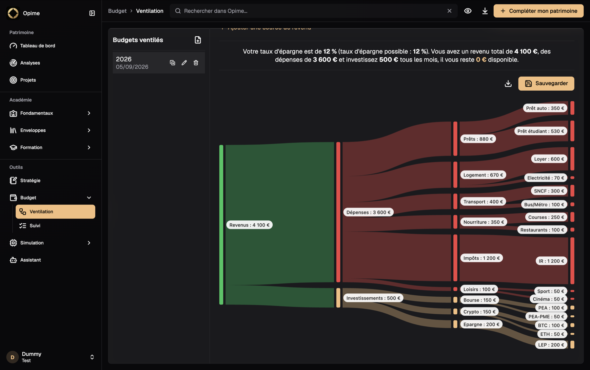
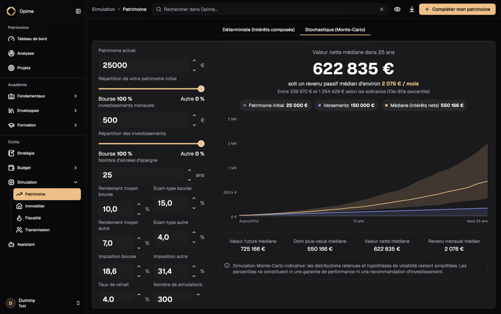

<div align="center">


# Opime

**Take back control of your net worth.**

Track every account, every investment, and every financial project you have — in one place, without ever sending your data anywhere but your own device.

[](LICENSE)
[](#getting-started)
[](https://opime.vercel.app)

**[✨ Try Opime right now in your browser — no install needed ✨](https://opime.vercel.app)**

</div>

---

Opime is a portfolio and net worth tracker with a **free-forever core**: unlimited accounts, every asset class, budget, financial simulations — no trial, no time limit, no credit card. It's also **open-source** (AGPL-3.0), so you can read every line that touches your money before you trust it with your data.

<div align="center">


</div>

> **Status:** early-stage / actively developed. Desktop (macOS) is the primary target right now; mobile builds are not yet configured. Expect rough edges.

---

## Why people use Opime

- 🆓 **Free forever, no limits** — unlimited accounts and asset/liability classes, not a crippled "trial" of the real thing.
- 🔒 **Local-first, always** — your data lives as plain JSON/Markdown in a folder *you* pick (iCloud Drive, Dropbox, or just your disk). Opime never phones home.
- 🔓 **Open-source** — AGPL-3.0. Inspect it, fork it, self-host it, hold it accountable.
- 👨‍👩‍👧‍👦 **Built for a whole household** — a separate, fully isolated account for your spouse, your kids, or anyone else you help manage money for.
- 💻 **Everywhere** — Flutter app for macOS, Windows, Linux, iOS, Android, and the web.
- 🎨 **Actually pleasant to use** — a modern, polished interface instead of a spreadsheet with a UI bolted on.

---

## What's included

Everything under the **Dashboard** is free, forever, with **no limit** on the number of accounts or which asset/liability classes you track:

| | Free | Opime Premium |
|---|:---:|:---:|
| Net worth dashboard, unlimited accounts & asset classes | ✅ | ✅ |
| Budget (allocation + tracking) | ✅ | ✅ |
| Strategy notes | ✅ | ✅ |
| Simulations — wealth, real estate, taxation, transmission | ✅ | ✅ |
| Académie — Fondamentaux & Enveloppes | ✅ | ✅ |
| **Analyses** — advanced allocation/performance charts | | ✅ |
| **Projets** — financial goal tracking | | ✅ |
| **Entités** — holdings, sociétés commerciales, SCI | | ✅ |
| **Assistant IA** — conversational assistant on your own data | | ✅ |
| **Académie > Formation** — guided courses (stocks, crypto, real estate, wealth structuring) | | ✅ |

The Premium-only tabs stay visible in the navigation, greyed out — clicking one shows a frozen, illustrative preview so you know exactly what you'd get, with a link to **[upgrade](https://opime.vercel.app/pricing)**. Their real implementation isn't part of this open-source repo, by design — only Opime Premium has it.

<div align="center">

 &nbsp; 

</div>

---

## Getting started

**Fastest way:** open **[opime.vercel.app](https://opime.vercel.app)** — it runs entirely in your browser, backed by a real folder on your disk, not browser-only storage.

**Or run it locally**, built with [Flutter](https://flutter.dev):

```bash
git clone https://github.com/Cl3mty/opime.git
cd opime
flutter pub get
flutter run -d macos   # or -d windows / -d linux
```

On first launch, you'll be asked to choose (or create) the folder where your data will live.

### Requirements
- Flutter SDK (stable channel)
- Xcode + CocoaPods (for macOS builds)
- Windows: Visual Studio with the "Desktop development with C++" workload (for Windows builds)

---

## Tech stack

- **[Flutter](https://flutter.dev)** — single codebase for desktop, mobile, and web
- **[shadcn_flutter](https://pub.dev/packages/shadcn_flutter)** — UI components
- **[flutter_quill](https://pub.dev/packages/flutter_quill)** — rich-text editing for Strategy notes
- Plain **JSON / Markdown files** for storage — no database, no backend

---

## Data & privacy

- All data is stored locally in the `Opime` folder you select — on desktop or in the web version (via a real folder on your disk, not browser-only storage) — nothing is ever sent to a server.
- **At-rest encryption is available, opt-in, from Settings.** Your vault is protected by a password plus a separate one-time recovery key; enabling/disabling it is crash-safe, so an interrupted toggle is detected and can be resumed on next launch rather than left half-encrypted. Until you turn it on, data stays as plain, human-readable JSON/Markdown files — don't put an unencrypted `Opime` folder in a publicly-shared location.
- Deleting a profile in the app removes it from the profile list but does **not** delete its data folder, so you can recover it manually if needed.

---

## Roadmap

- [ ] Dashboard with consolidated net worth across profiles (currently shown per profile, not combined)
- [ ] Mobile builds (iOS / Android) — default Flutter scaffolding exists, but the app is still built and tested desktop-first
- [ ] Native in-app installer flow for updates (instead of opening the browser)

Contributions and ideas welcome — have a look at the [Ideas discussions](https://github.com/Cl3mty/opime/discussions/categories/ideas) to vote on existing proposals or post your own.

---

## Support the project

Opime's core has no ads and is free forever. Here's how to help it keep going:

- ⭐ **[Star the repo](https://github.com/Cl3mty/opime)** — the easiest way to help it reach more people.
- 💡 **[Vote on ideas](https://github.com/Cl3mty/opime/discussions/categories/ideas)** or post your own — it directly shapes what gets built next.
- 💎 **[Upgrade to Opime Premium](https://opime.vercel.app/pricing)** for Analyses, Projets, Entités, the AI Assistant, and the Académie Formation courses — this is what funds development of the free edition too.

---

## License

Opime is licensed under the **[GNU Affero General Public License v3.0](LICENSE)** (AGPL-3.0). In short: you're free to use, study, modify, and redistribute this code — including running a modified version as a network service — as long as you make your source (including your modifications) available under the same license to anyone who interacts with it over a network.

Opime Premium (the paid tier referenced above) is a separate, proprietary codebase and is not covered by this license.
